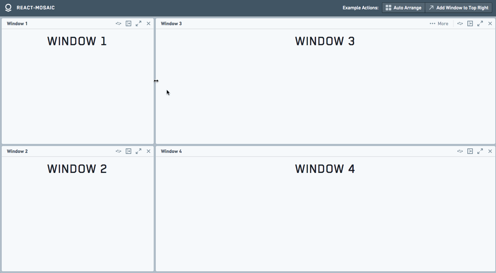

# react-mosaic

[](https://circleci.com/gh/nomcopter/react-mosaic/tree/master)
[](https://www.npmjs.com/package/react-mosaic-component)

react-mosaic is a full-featured React Tiling Window Manager meant to give a user complete control over their workspace.
It provides a simple and flexible API to tile arbitrarily complex react components across a user's view.
react-mosaic is written in TypeScript and provides typings but can be used in JavaScript as well.

The best way to see it is a simple [**Demo**](https://nomcopter.github.io/react-mosaic/).

#### Screencast

[](./screencast.gif)

## Usage

The core of react-mosaic's operations revolve around the simple binary tree [specified by `MosaicNode<T>`](./src/types.ts#L12).
[`T`](./src/types.ts#L7) is the type of the leaves of the tree and is a `string` or a `number` that can be resolved to a `JSX.Element` for display.

### Installation

1.  `yarn add react-mosaic-component`
1.  Make sure `react-mosaic-component.css` is included on your page.
1.  Import the `Mosaic` component and use it in your app.
1.  (Optional) Install Blueprint

### Blueprint Theme

Without a theme, Mosaic only loads the styles necessary for it to function -
making it easier for the consumer to style it to match their own app.

By default, Mosaic renders with the `mosaic-blueprint-theme` class.
This uses the excellent [Blueprint](http://blueprintjs.com/) React UI Toolkit to provide a good starting state.
It is recommended to at least start developing with this theme.
To use it install Blueprint `yarn add @blueprintjs/core @blueprintjs/icons` and add their CSS to your page.
Don't forget to set `blueprintNamespace` in `Mosaic` to the correct value for the version of Blueprint you are using.

See [blueprint-theme.less](./styles/blueprint-theme.less) for an example of creating a theme.

#### Blueprint Dark Theme

Mosaic supports the Blueprint Dark Theme out of the box when rendered with the `mosaic-blueprint-theme bp3-dark` class.

### Examples

#### Simple Tiling

##### app.css

```css
html,
body,
#app {
  height: 100%;
  width: 100%;
  margin: 0;
}
```

##### App.tsx

```tsx
import { Mosaic } from 'react-mosaic-component';

import 'react-mosaic-component/react-mosaic-component.css';
import '@blueprintjs/core/lib/css/blueprint.css';
import '@blueprintjs/icons/lib/css/blueprint-icons.css';

import './app.css';

const ELEMENT_MAP: { [viewId: string]: JSX.Element } = {
  a: <div>Left Window</div>,
  b: <div>Top Right Window</div>,
  c: <div>Bottom Right Window</div>,
};

export const app = (
  <div id="app">
    <Mosaic<string>
      renderTile={(id) => ELEMENT_MAP[id]}
      initialValue={{
        direction: 'row',
        first: 'a',
        second: {
          direction: 'column',
          first: 'b',
          second: 'c',
        },
        splitPercentage: 40,
      }}
    />
  </div>
);
```

`renderTile` is a stateless lookup function to convert `T` into a displayable `JSX.Element`.
By default `T` is `string` (so to render one element `initialValue="ID"` works).
`T`s must be unique within an instance of `Mosaic`, they are used as keys for [React list management](https://reactjs.org/docs/lists-and-keys.html).
`initialValue` is a [`MosaicNode<T>`](./src/types.ts#L12).

The user can resize these panes but there is no other advanced functionality.
This example renders a simple tiled interface with one element on the left half, and two stacked elements on the right half.
The user can resize these panes but there is no other advanced functionality.

#### Drag, Drop, and other advanced functionality with `MosaicWindow`

`MosaicWindow` is a component that renders a toolbar and controls around its children for a tile as well as providing full featured drag and drop functionality.

```tsx
export type ViewId = 'a' | 'b' | 'c' | 'new';

const TITLE_MAP: Record<ViewId, string> = {
  a: 'Left Window',
  b: 'Top Right Window',
  c: 'Bottom Right Window',
  new: 'New Window',
};

export const app = (
  <Mosaic<ViewId>
    renderTile={(id, path) => (
      <MosaicWindow<ViewId> path={path} createNode={() => 'new'} title={TITLE_MAP[id]}>
        <h1>{TITLE_MAP[id]}</h1>
      </MosaicWindow>
    )}
    initialValue={{
      direction: 'row',
      first: 'a',
      second: {
        direction: 'column',
        first: 'b',
        second: 'c',
      },
    }}
  />
);
```

Here `T` is a `ViewId` that can be used to look elements up in `TITLE_MAP`.
This allows for easy view state specification and serialization.
This will render a view that looks very similar to the previous examples, but now each of the windows will have a toolbar with buttons.
These toolbars can be dragged around by a user to rearrange their workspace.

`MosaicWindow` API docs [here](#mosaicwindow).

#### Controlled vs. Uncontrolled

Mosaic views have two modes, similar to `React.DOM` input elements:

- Controlled, where the consumer manages Mosaic's state through callbacks.
  Using this API, the consumer can perform any operation upon the tree to change the the view as desired.
- Uncontrolled, where Mosaic manages all of its state internally.

See [Controlled Components](https://facebook.github.io/react/docs/forms.html#controlled-components).

All of the previous examples show use of Mosaic in an Uncontrolled fashion.

#### Example Application

See [ExampleApp](demo/ExampleApp.tsx) (the application used in the [Demo](https://nomcopter.github.io/react-mosaic/))
for a more interesting example that shows the usage of Mosaic as a controlled component and modifications of the tree structure.

## API

#### Mosaic Props

```typescript
export interface MosaicBaseProps<T extends MosaicKey> {
  /**
   * Lookup function to convert `T` to a displayable `JSX.Element`
   */
  renderTile: TileRenderer<T>;
  /**
   * Called when a user initiates any change to the tree (removing, adding, moving, resizing, etc.)
   */
  onChange?: (newNode: MosaicNode<T> | null) => void;
  /**
   * Called when a user completes a change (fires like above except for the interpolation during resizing)
   */
  onRelease?: (newNode: MosaicNode<T> | null) => void;
  /**
   * Additional classes to affix to the root element
   * Default: 'mosaic-blueprint-theme'
   */
  className?: string;
  /**
   * Options that control resizing
   * @see: [[ResizeOptions]]
   */
  resize?: ResizeOptions;
  /**
   * View to display when the current value is `null`
   * default: Simple NonIdealState view
   */
  zeroStateView?: JSX.Element;
  /**
   * Override the mosaicId passed to `react-dnd` to control how drag and drop works with other components
   * Note: does not support updating after instantiation
   * default: Random UUID
   */
  mosaicId?: string;
  /**
   * Make it possible to use different versions of Blueprint with `mosaic-blueprint-theme`
   * Note: does not support updating after instantiation
   * default: 'bp3'
   */
  blueprintNamespace?: string;
  /**
   * Override the react-dnd provider to allow applications to inject an existing drag and drop context
   */
  dragAndDropManager?: DragDropManager | undefined;
}

export interface MosaicControlledProps<T extends MosaicKey> extends MosaicBaseProps<T> {
  /**
   * The tree to render
   */
  value: MosaicNode<T> | null;
  onChange: (newNode: MosaicNode<T> | null) => void;
}

export interface MosaicUncontrolledProps<T extends MosaicKey> extends MosaicBaseProps<T> {
  /**
   * The initial tree to render, can be modified by the user
   */
  initialValue: MosaicNode<T> | null;
}

export type MosaicProps<T extends MosaicKey> = MosaicControlledProps<T> | MosaicUncontrolledProps<T>;
```

#### `MosaicWindow`

```typescript
export interface MosaicWindowProps<T extends MosaicKey> {
  title: string;
  /**
   * Current path to this window, provided by `renderTile`
   */
  path: MosaicBranch[];
  className?: string;
  /**
   * Controls in the top right of the toolbar
   * default: [Replace, Split, Expand, Remove] if createNode is defined and [Expand, Remove] otherwise
   */
  toolbarControls?: React.ReactNode;
  /**
   * Additional controls that will be hidden in a drawer beneath the toolbar.
   * default: []
   */
  additionalControls?: React.ReactNode;
  /**
   * Label for the button that expands the drawer
   */
  additionalControlButtonText?: string;
  /**
   * A callback that triggers when a user toggles the additional controls
   */
  onAdditionalControlsToggle?: (toggle: boolean) => void;
  /**
   * Disables the overlay that blocks interaction with the window when additional controls are open
   */
  disableAdditionalControlsOverlay?: boolean;
  /**
   * Whether or not a user should be able to drag windows around
   */
  draggable?: boolean;
  /**
   * Method called when a new node is required (such as the Split or Replace buttons)
   */
  createNode?: CreateNode<T>;
  /**
   * Optional method to override the displayed preview when a user drags a window
   */
  renderPreview?: (props: MosaicWindowProps<T>) => JSX.Element;
  /**
   * Optional method to override the displayed toolbar
   */
  renderToolbar?: ((props: MosaicWindowProps<T>, draggable: boolean | undefined) => JSX.Element) | null;
  /**
   * Optional listener for when the user begins dragging the window
   */
  onDragStart?: () => void;
  /**
   * Optional listener for when the user finishes dragging a window.
   */
  onDragEnd?: (type: 'drop' | 'reset') => void;
}
```

The default controls rendered by `MosaicWindow` can be accessed from [`defaultToolbarControls`](./src/buttons/defaultToolbarControls.tsx)

### Advanced API

The above API is good for most consumers, however Mosaic provides functionality on the [Context](https://facebook.github.io/react/docs/context.html) of its children that make it easier to alter the view state.
All leaves rendered by Mosaic will have the following available on React context.
These are used extensively by `MosaicWindow`.

```typescript
/**
 * Valid node types
 * @see React.Key
 */
export type MosaicKey = string | number;
export type MosaicBranch = 'first' | 'second';
export type MosaicPath = MosaicBranch[];

/**
 * Context provided to everything within Mosaic
 */
export interface MosaicContext<T extends MosaicKey> {
  mosaicActions: MosaicRootActions<T>;
  mosaicId: string;
}

export interface MosaicRootActions<T extends MosaicKey> {
  /**
   * Increases the size of this node and bubbles up the tree
   * @param path Path to node to expand
   * @param percentage Every node in the path up to root will be expanded to this percentage
   */
  expand: (path: MosaicPath, percentage?: number) => void;
  /**
   * Remove the node at `path`
   * @param path
   */
  remove: (path: MosaicPath) => void;
  /**
   * Hide the node at `path` but keep it in the DOM. Used in Drag and Drop
   * @param path
   */
  hide: (path: MosaicPath) => void;
  /**
   * Replace currentNode at `path` with `node`
   * @param path
   * @param node
   */
  replaceWith: (path: MosaicPath, node: MosaicNode<T>) => void;
  /**
   * Atomically applies all updates to the current tree
   * @param updates
   * @param suppressOnRelease (default: false)
   */
  updateTree: (updates: MosaicUpdate<T>[], suppressOnRelease?: boolean) => void;
  /**
   * Returns the root of this Mosaic instance
   */
  getRoot: () => MosaicNode<T> | null;
}
```

Children (and toolbar elements) within `MosaicWindow` are passed the following additional functions on context.

```typescript
export interface MosaicWindowContext<T extends MosaicKey> extends MosaicContext<T> {
  mosaicWindowActions: MosaicWindowActions;
}

export interface MosaicWindowActions {
  /**
   * Fails if no `createNode()` is defined
   * Creates a new node and splits the current node.
   * The current node becomes the `first` and the new node the `second` of the result.
   * `direction` is chosen by querying the DOM and splitting along the longer axis
   */
  split: () => Promise<void>;
  /**
   * Fails if no `createNode()` is defined
   * Convenience function to call `createNode()` and replace the current node with it.
   */
  replaceWithNew: () => Promise<void>;
  /**
   * Sets the open state for the tray that holds additional controls.
   * Pass 'toggle' to invert the current state.
   */
  setAdditionalControlsOpen: (open: boolean | 'toggle') => void;
  /**
   * Returns the path to this window
   */
  getPath: () => MosaicPath;
  /**
   * Enables connecting a different drag source besides the react-mosaic toolbar
   */
  connectDragSource: (connectedElements: React.ReactElement<any>) => React.ReactElement<any>;
}
```

To access the functions simply use the [`MosaicContext`](./src/contextTypes.ts#L90)
or [`MosaicWindowContext`](./src/contextTypes.ts#L91) [context consumers](https://reactjs.org/docs/context.html#contextconsumer).

### Mutating the Tree

Utilities are provided for working with the MosaicNode tree in [`mosaicUtilities`](src/util/mosaicUtilities.ts) and
[`mosaicUpdates`](src/util/mosaicUpdates.ts)

#### MosaicUpdate

[`MosaicUpdateSpec`](./src/types.ts#L33) is an argument meant to be passed to [`immutability-helper`](https://github.com/kolodny/immutability-helper)
to modify the state at a path.
[`mosaicUpdates`](src/util/mosaicUpdates.ts) has examples.

## Upgrade Considerations / Changelog

See [Releases](https://github.com/nomcopter/react-mosaic/releases)

## License

Copyright 2019 Kevin Verdieck, originally developed at Palantir Technologies, Inc.

Licensed under the Apache License, Version 2.0 (the "License");
you may not use this file except in compliance with the License.
You may obtain a copy of the License at

    http://www.apache.org/licenses/LICENSE-2.0

Unless required by applicable law or agreed to in writing, software
distributed under the License is distributed on an "AS IS" BASIS,
WITHOUT WARRANTIES OR CONDITIONS OF ANY KIND, either express or implied.
See the License for the specific language governing permissions and
limitations under the License.
