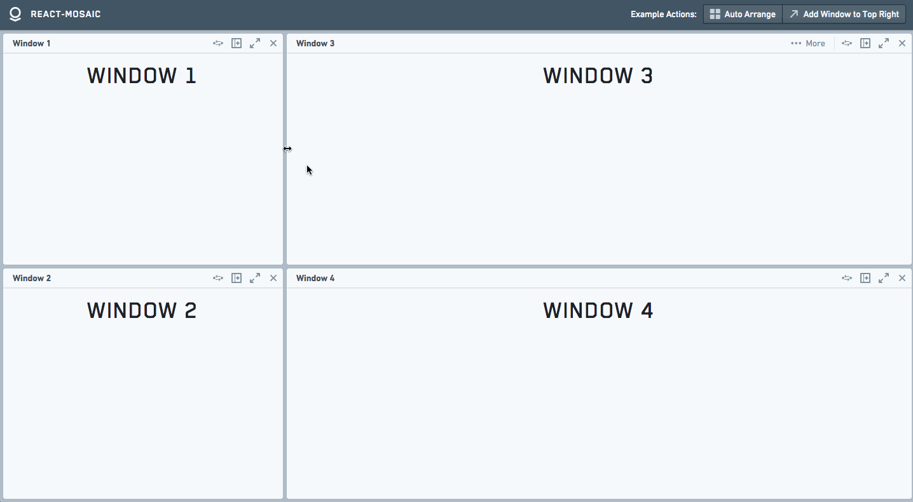

[](https://www.npmjs.com/package/react-mosaic-component)
[](https://reactjs.org/)
[](https://www.typescriptlang.org/)

<p align="center">

</p>

**react-mosaic** is a React tiling window manager. It gives you a drag-to-resize, drag-to-rearrange layout of panels that users can freely rearrange — inspired by IDE window management and i3-style tiling.

**📖 [Documentation](https://nomcopter.github.io/react-mosaic/) · 🎮 [Demo](https://nomcopter.github.io/react-mosaic/demo) · 📚 [API reference](https://nomcopter.github.io/react-mosaic/docs/api) · 🚚 [Migration from v6](https://nomcopter.github.io/react-mosaic/docs/migration/from-v6)**

[](./screencast.gif)

## Install

```bash
npm install react-mosaic-component react react-dom
```

Import the stylesheet in your app's entry point:

```tsx
import 'react-mosaic-component/react-mosaic-component.css';
```

## Quick start

```tsx
import { Mosaic, MosaicWindow } from 'react-mosaic-component';
import 'react-mosaic-component/react-mosaic-component.css';

export function App() {
  return (
    <div style={{ height: '100vh' }}>
      <Mosaic<string>
        renderTile={(id, path) => (
          <MosaicWindow<string> path={path} title={`Panel ${id}`}>
            <div style={{ padding: 20 }}>Contents of {id}</div>
          </MosaicWindow>
        )}
        initialValue={{
          type: 'split',
          direction: 'row',
          children: ['a', 'b'],
        }}
      />
    </div>
  );
}
```

That's a two-panel layout with a draggable divider, drag handles on each window title bar, and default toolbar buttons — in 15 lines.

For live editable examples, the n-ary tree model, custom toolbars, tabs, theming, and the full API reference, see the **[documentation site](https://nomcopter.github.io/react-mosaic/)**.

## Features

- **N-ary tree layouts.** A single split can hold any number of children, not just two.
- **Tabs as first-class citizens.** Tab containers are a node type, not a bolted-on convention.
- **Controlled or uncontrolled.** Pass `value` + `onChange` to manage the tree yourself, or `initialValue` to let the component own it.
- **Drag-and-drop.** Built on `react-dnd` with HTML5 and touch backends.
- **Theming.** Works with or without Blueprint; ships a default CSS theme plus CSS variables you can override.
- **Zero-config migration.** Legacy v6 binary trees are auto-converted at render time. `convertLegacyToNary` is available for explicit upgrades.

## Contributing

Contributions are welcome. See [CONTRIBUTING_AI.md](./CONTRIBUTING_AI.md) for repo layout and development workflow, or jump into the docs:

- Clone and install: `npm install`
- Start the docs site (hot-reloads the demo and live code blocks): `npm start`
- Build the library: `npm run build:lib`
- Run tests: `npm test`
- Lint: `npm run lint`

Issues and pull requests: [github.com/nomcopter/react-mosaic](https://github.com/nomcopter/react-mosaic)

## License

Apache License 2.0 — see [LICENSE](./LICENSE).

Originally developed by Kevin Verdieck at Palantir Technologies, Inc.
